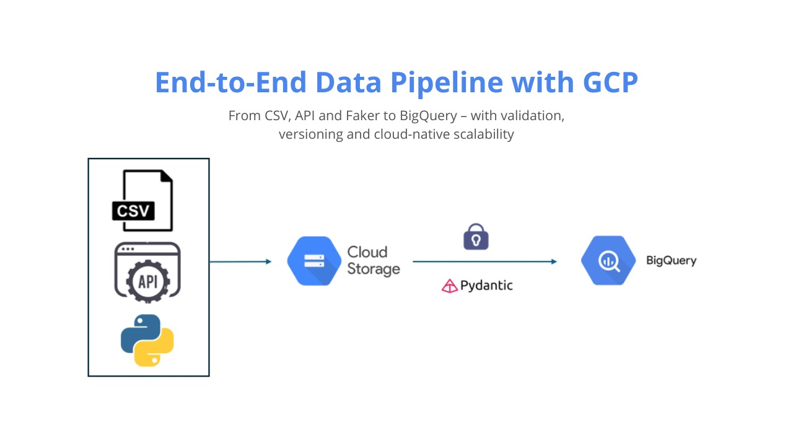
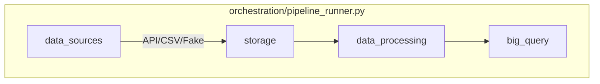

# Lightweight ETL Pipeline to GCP (without Airflow)

<p align="center">
  
</p>

An ETL (Extract, Transform, Load) pipeline that extracts employee data from multiple sources, masks sensitive information, and loads it into Google BigQuery. Designed for environments where Airflow is unavailable (due to permissions, infrastructure constraints, or complexity). It provides a no-frills, dependency-light way to define, schedule, and monitor ETL workflows using Python libraries.

<br>

## Objectives
- Works in Restricted Environments – No need for Airflow, Docker, or complex setups.
- Easy to Deploy – Runs anywhere Python runs (even on locked-down servers).
- Minimal Overhead – Perfect for small scale ETL needs.

<br>

## Project Structure
```python
project/
├── src/
│ ├── data_sources/ # Data extraction modules
│ │ ├── api_extractor.py # API data extraction
│ │ ├── csv_extractor.py # CSV file handling and generation
│ │ └── faker_generator.py # Faker data generation
│ │
│ ├── storage/ # Storage operations
│ │ └── gcs_uploader.py # Google Cloud Storage uploader
│ │
│ ├── data_processing/ # Data transformation
│ │ ├── data_masking.py # Masking
│ │ └── data_validator.py # Data quality validation
│ │
│ ├── big_query/ # BigQuery integration
│ │ └── bigquery_loader.py # BigQuery data loader
│ │
│ ├── orchestration/ # Pipeline control
│ │ └── pipeline_runner.py # Main pipeline executor
│ │
│ └── config/ # Configuration files
│ ├── settings.py # Project settings
│ └── credentials/ # GCP service account JSON files
│
├── test/ # Unit tests
│ └── test_data_validator.py
│
├── .env.example # Environment variables template
├── requirements.txt # Python dependencies
└── README.md # This file
```
<br>

1. Data Ingestion (data_sources/)
- Multi-source Extraction:
    - api_extractor.py: fetches data from REST APIs
    - csv_extractor.py: generates/Exports CSV files
    - faker_generator.py: generates synthetic datasets for testing

2. Data Storage (storage/)
- GCS Integration:
    - gcs_uploader.py: uploads processed data to Google Cloud Storage in parquet format

3. Data Processing (data_processing/)
- Quality & Privacy:
    - data_validator.py: validates schema, checks for nulls/duplicates
    - data_masking.py: anonymizes emails and phones using tokenization

4. Data Loading (big_query/)
- Analytics Ready:
    - bigquery_loader.py: automates BigQuery table creation and batch loading with schema detection

<br>

## Project Architecture


<br>

-------------

## Setup Instructions
0. Prerequisites
    - Python version > 3.12
    - uv library (install with `pipx install uv` or `pip install uv`)

<br>

1. Clone the repository and change the directory
```bash
git clone https://github.com/kajinmo/lightweight-etl-pipeline-to-gcp
cd lightweight-etl-pipeline-to-gcp
```

<br>

2. Create a venv environment and install the dependencies with `uv`
```bash
uv sync
```

<br>

3. Activate the virtual environment
```bash
source .venv/Scripts/activate
```

<br>

4. Open VSCode
```bash
code .
```

<br>

5. Configure VSCode to use the virtual environment

- Open the Command Palette (`Ctrl+Shift+P` or `Cmd+Shift+P` on macOS)
- Search for "`Python: Select Interpreter`"
- Choose the interpreter within the folder `.venv` (e.g., .venv/bin/python or .venv/Scripts/python.exe)

<br>

6. Follow the "Step by Step: Create and Use a Service Account on Google Cloud" guide below to configure your GCP

7. Execution and Testing
```bash
# Start the orchestrator
task run

# Run tests locally
task test
```


## Step by Step: Create and Use a Service Account on Google Cloud
1. Access the Google Cloud Console: https://console.cloud.google.com/

<br>

2. Open project picker (or press Ctrl+O) and create a project or select an existing one.

<br>

3. Enable the Google Cloud Storage API:
- Go to https://console.cloud.google.com/apis/library/storage.googleapis.com
- Click "Enable" if it isn't already enabled.

<br>

4. Create a Service Account:
- Go to https://console.cloud.google.com/iam-admin/serviceaccounts
- Click "+ Create Service Account"
- Fill in the fields:
    - Name: (leave whatever you want)
    - Service Account ID: (leave whatever it generates)
    - Click Create and Continue
- Grant permissions:
    - Role: Storage Admin
    - Role: BigQuery Admin
- Click Continue and then Finish

<br>

5. Create a JSON key for the Service Account
- In the list of service accounts, click the account you just created.
- Go to the Keys tab.
- Click "Add Key" → "Create New Key"
- Choose the JSON type
- Click Create – the .json file will start downloading automatically.
- Place this file in the project's `config/credentials/` folder

<br>

6. Create and modify the parameters in the .env file